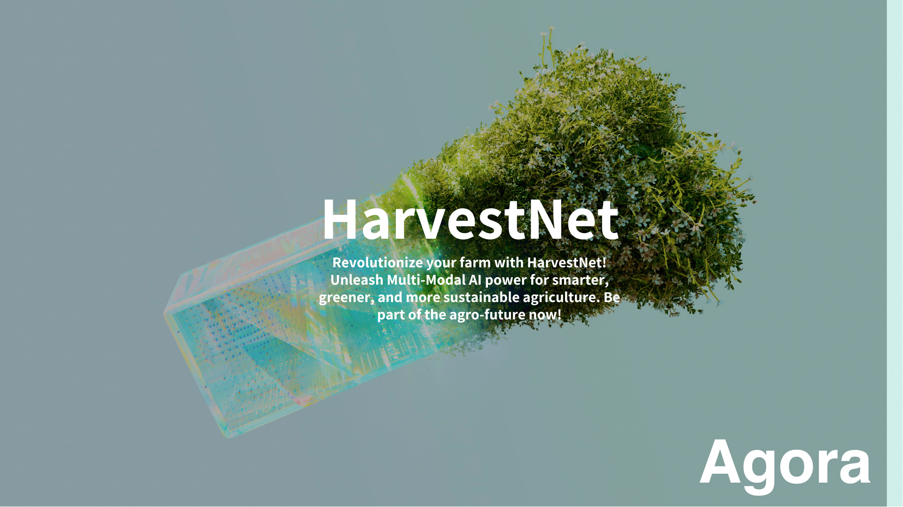

# 🌾 HarvestNet 🌽 

Revolutionize your farm with HarvestNet! Unleash AI power for smarter, greener, and more sustainable agriculture. Be part of the agro-future now! 🌎

## 🌱 Architecture 🏗️

HarvestNet is organized into task-specific folders, each containing plug-and-play Colab notebooks 📔 and multi-modal Chatbot APIs 🗣️ for seamless integration into your existing agriculture stack.

### 📁 Folders:

1. 🌦️ Weather Prediction
2. 🐜 Pest Control
3. 💦 Irrigation Optimization
4. 🌾 Crop Yield Estimation
5. 🍎 Quality Control
6. 🌱 Seeding Optimization
7. 📈 Market Prediction
8. 🌞 Sunlight Optimization
9. 🌾 Weed Identification & Control
10. 💧 Water Quality Analysis
... and many more!

Each folder is designed as a standalone solution to a common agricultural challenge, powered by our cutting-edge multi-modal AI.

## 🌍 Share with Friends!

If you find HarvestNet useful, don't forget to share with your friends, fellow farmers, and agriculturists! We believe in growing together. Here's a handy link to pass along: `https://github.com/HarvestNet`

## 🚜 Top 20 Agriculture Problems and How Multi-modal AI Can Help 🌱

1. **Weather Prediction** 🌦️ - Use AI to predict local weather conditions, and prepare your farm accordingly.
2. **Pest Control** 🐜 - Identify and control pests using image recognition and predictive models.
3. **Irrigation Optimization** 💦 - Save water and energy by predicting the optimal irrigation schedule.
4. **Crop Yield Estimation** 🌾 - Estimate your yield before harvest using AI algorithms.
5. **Quality Control** 🍎 - Automated quality checks for crops using machine learning models.
6. **Seeding Optimization** 🌱 - Optimize seed sowing using AI to predict best conditions.
7. **Market Prediction** 📈 - Use AI to predict market trends for various crops.
8. **Sunlight Optimization** 🌞 - AI can help in managing crop sun exposure for better yields.
9. **Weed Identification & Control** 🌾 - Detect and control weeds using AI.
10. **Water Quality Analysis** 💧 - Analyze water quality for irrigation using AI sensors.
... and many more!

Join us in our mission to revolutionize farming and make it smarter, greener, and more sustainable. Welcome to the future of agriculture with HarvestNet! 🌾🚀

## Architecture 

| Task  | Model | Dataset | Description |
| --- | --- | --- | --- |
| Weather Prediction | Time-series forecasting models like ARIMA, LSTM or Transformer models. | [NOAA Climate Data](https://www.ncdc.noaa.gov/data-access) | These models can learn patterns in historical weather data to predict future weather conditions. |
| Pest Control | Convolutional Neural Networks (CNNs) for image classification or object detection models like YOLO, SSD or Faster-RCNN. | [IP102: A Large-Scale Benchmark Dataset for Insect Pest Recognition](https://github.com/xpwu95/IP102) | These models can identify pests in crop images to alert for necessary action. |
| Irrigation Optimization | Reinforcement Learning models can be used to learn optimal irrigation schedules. | [Soil Moisture Dataset](https://www.kaggle.com/c/ams-2014-solar-energy-prediction-contest/data) | The model can learn to irrigate based on the soil moisture levels and weather conditions to optimize water usage. |
| Crop Yield Estimation | Regression models like Random Forest, XGBoost or Neural Networks. | [USDA's Agricultural Resource Management Survey Data](https://www.ers.usda.gov/data-products/arms-farm-financial-and-crop-production-practices/) | These models can predict the yield based on various conditions and practices. |
| Quality Control | Image classification models like CNNs or object detection models for more detailed analysis. | [Fruit Images for Object Detection](https://www.kaggle.com/mbkinaci/fruit-images-for-object-detection) | These models can be used to automate the quality control process by classifying crops into different quality grades. |
| Seeding Optimization | Reinforcement Learning models for learning optimal seeding schedules. | [USDA's Agricultural Resource Management Survey Data](https://www.ers.usda.gov/data-products/arms-farm-financial-and-crop-production-practices/) | These models can suggest the best time to sow seeds based on historical data and environmental conditions. |
| Market Prediction | Time-series forecasting models like ARIMA, LSTM or Transformer models. | [Commodity Futures Historical Data](https://www.quandl.com/databases/SCF) | These models can predict crop prices to help farmers decide when to sell their crops. |
| Sunlight Optimization | Reinforcement Learning or Control Theory based models. | [NASA Surface Meteorology and Solar Energy](https://power.larc.nasa.gov/data-access-viewer/) | These models can help manage crop exposure to sunlight by controlling sunshades or other sunlight management systems. |
| Weed Identification & Control | Image classification or object detection models like CNNs, YOLO, SSD, or Faster-RCNN. | [CWFID: Crop/Weed Field Image dataset](https://github.com/cwfid/dataset) | These models can identify weeds in crop images to alert for necessary action. |
| Water Quality Analysis | CNNs for image-based analysis or MLPs for sensor data. | [Water Quality Dataset](https://www.kaggle.com/adityakadiwal/water-potability) | These models can analyze water quality for safe and effective irrigation. |
